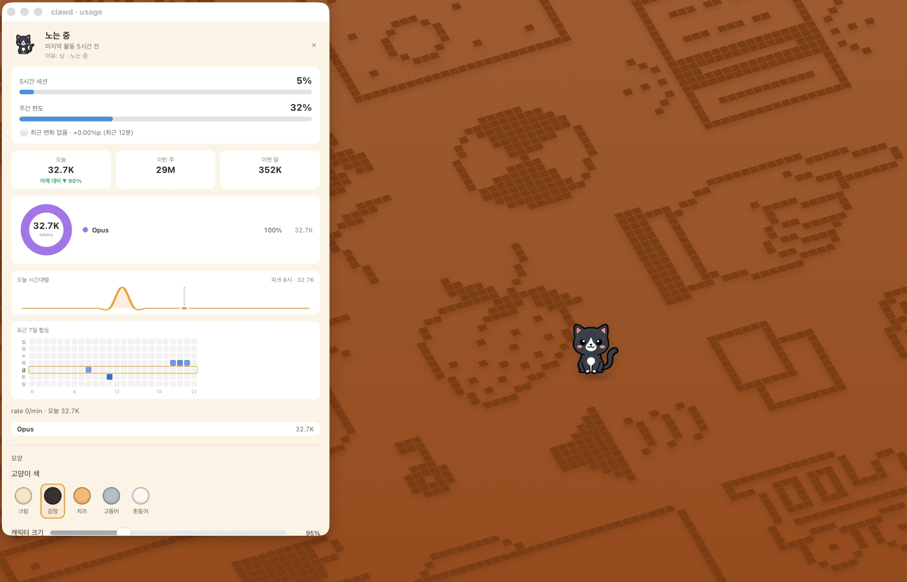
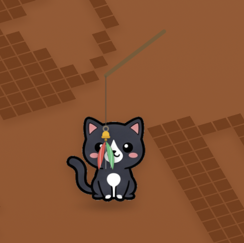

# 🐱 clawd

[English](README.md) | [**한국어**](README.ko.md)

[](./LICENSE)


> Claude를 얼마나 굴리고 있는지에 반응하며 Mac 위를 떠다니는 귀여운 고양이.

작고, 테두리 없고, 항상 위에 떠 있는 고양이가 데스크톱을 돌아다니며 Claude 사용량에
따라 기분이 바뀐다. 한가하면 놀거나 (밤에는) 낮잠을 자고, 토큰을 태우기 시작하면
활기를 띠다가 하악질을 하며, session limit에 가까워지면 지쳐 늘어진다. 로컬
**Claude Code** 로그를 읽고, 선택적으로 **5시간 session·주간 한도**까지 추적할 수
있는데 — 이 경로는 claude.ai **웹** 사용량까지 포함한다. 기본값은 **roam**으로,
클릭이 그대로 통과하고 고양이가 알아서 돌아다니다가 — 당신이 **grab**(**⌘⇧C** 또는
tray)하면 그때부터 드래그·쓰다듬기·설정이 가능해진다. tray에서 **🎣 낚싯대**와
**🍚 먹이 주기**로 함께 놀 수 있고, **네트워크**로 친구의 고양이를 초대할 수도 있다.

```
   /\_/\     clawd watches ~/.claude/projects/**/*.jsonl (ccusage-style
  ( o.o )    token+cost aggregation, re-implemented in Rust), optionally
   > ^ <     reads your session/weekly limits, and maps it onto a 7-state cat.
```

## 목차

- [스크린샷](#스크린샷)
- [기능](#기능)
- [설치](#설치) · [첫 실행 (Gatekeeper)](#첫-실행-gatekeeper)
- [콘셉트](#콘셉트) · [고양이 상태](#고양이-상태)
- [요구 사항](#요구-사항) · [실행](#실행) · [빌드](#빌드) · [릴리스 과정](#릴리스-과정)
- [권한 (macOS)](#권한-macos)
- [사용법](#사용법) · [임계값 조정](#임계값-조정)
- [Session 사용량 (실험적)](#session-사용량-실험적)
- [고양이 아트 & 코트 컬러](#고양이-아트--코트-컬러) · [사용량 계산 방식](#사용량-계산-방식)
- [프로젝트 구조](#프로젝트-구조) · [알려진 한계](#알려진-한계)
- [변경 이력](#변경-이력) · [로드맵](#로드맵)
- [기여하기](#기여하기) · [감사의 말](#감사의-말) · [라이선스](#라이선스)

## 스크린샷

**데스크톱 위에서** — 고양이가 돌아다니고, 기분이 활동량을 따라가며, 톡 건드리면 상태 툴팁이 뜬다.


**사용량 대시보드** — 5시간 session·주간 게이지, 오늘/이번 주/이번 달 토큰, 그리고 모델·시간대·주간 활동 차트.



**낚시 놀이** — 커서로 유인용 낚싯대를 움직이면 고양이가 매달린 미끼를 쫓는다.



---

## 기능

- **🎨 코트 컬러 5종** — cream · black · orange tabby · gray tabby · white,
  상세 창에서 실시간 교체.
- **🐈 10종 이상의 다양한 포즈** — sit · walk · run · sleep · alert · angry ·
  exhausted · blink · yawn · stretch · pounce · startled · eating · purr …
- **🚶 화면 배회** — 애니메이션 walk/run 걸음걸이, 방향 반전, workarea에 clamp된
  eased random walk.
- **🛋️ 상태 기반 가구** — 쿠션(잘 때), 캣타워(alert/angry), 밥그릇(exhausted/먹이 주기)이
  상황에 맞게 등장하고, 캣타워는 하루 사용량에 따라 **3단계로 진화**한다.
- **🐾 가구 방문** — 활동 중(curious / active / playing)일 때, 고양이가 무작위로
  소품(캣타워·쿠션·밥그릇)으로 종종걸음쳐 다가간다 — 방문 동안 소품이 페이드인되고,
  그 자리에서 놀다가 떠나는데, 떠다니는 장난감을 쫓을 때와 같은 방식이다.
- **🦋 장난감** — 나비, 공, 실뭉치, 새가 화면을 가로지르면 고양이가 쫓아가(덮치기까지)
  한다.
- **✨ 마이크로 이벤트** — 귀 씰룩임, 뒤돌아보기, 힘줘 눈 깜빡이기 등으로 쉬고 있는
  고양이에게 생기를 준다.
- **🌙 하루의 리듬** — 한가한 밤에는 톤을 낮추고 낮잠을 자며 아침에는 기지개를 켠다.
  낮에 한가한 고양이는 자지 않고 깨어서 논다. 짧은 실행 grace가 있어 켜자마자 이미
  잠들어 있는 일은 없다.
- **🎣 낚시 놀이** — tray에서 커서로 유인용 낚싯대를 흔들면, 깃털이 실에 매달려 실제
  물리로 흔들리고 고양이가 그것을 쫓는다. overlay는 click-through를 유지하므로 노는
  동안에도 다른 앱은 계속 클릭할 수 있다(tray 항목을 다시 클릭하면 종료).
- **🍚 먹이 주기 & 🖐️ 쓰다듬기** — tray에서 먹이를 주면(고양이가 밥그릇으로 종종걸음쳐
  간다), Grab 모드에서 위에 커서를 올리거나 누르고 있으면 골골거리고 하트가 떠오른다.
- **⚡ 사용량 리액션** — Claude 활동에 실시간으로 반응한다: 토큰이 갑자기 폭주하면
  **zoomies(질주)**, 새 **5시간 session 창**이 열리면(session 사용량 연동 시) 기지개를 켠다.
- **🎉 축하 연출** — **캣타워가 진화**하면(오늘 토큰이 상위 tier 돌파) 컨페티가 터지고,
  고양이를 빠르게 여러 번 클릭하면 숨겨진 **파티**가 열리며, 아주 가끔 **골든 캣**이 반짝인다.
- **🌙 밤샘·휴식 챙김** — 새벽까지 작업하거나 오래 쉼 없이 달리면 고양이가 잠깐 쉬라고
  살짝 챙겨준다.
- **💬 개성** — 실행 인사말이 시간대(와 명절)에 맞춰 바뀌고, 가끔 혼잣말을 중얼거린다.
- **🏆 업적·도감 & 💞 유대감** — 모으는 도감(첫 골든 캣, 먹이 10번, 타워 마스터 등)과
  먹이·쓰다듬기·집중으로 오르는 유대감 레벨 — 상세창에서 확인.
- **🍅 뽀모도로** — 고양이가 함께 집중 타이머를 돌린다. 집중 중엔 🍅 배지와 함께 얌전해지고,
  완주하면 축하해준다.
- **🏷️ 이름 + 조용 모드** — 고양이 이름을 지으면 인사말·툴팁에 표시되고 **네트워크 모드에서
  친구 화면에도 같은 이름**으로 뜬다(한 이름 공용). **재미 효과** 토글로 모든 연출을 꺼서
  미니멀하게 쓸 수도 있다.
- **🎩 꾸미기** — 이모지 악세서리(리본/중절모/왕관/캡/꽃)를 골라 고양이 위에 씌운다.
  크기·좌우반전이 고양이와 함께 따라간다.
- **📊 Session 사용량 연동 (실험적)** — 선택적으로 **5시간 session**과 **주간** 한도를
  실시간 게이지로 표시하고, 한도 근처에서 미리 알려주는 알림을 띄운다. Claude Code
  OAuth token을 쓰기 때문에 claude.ai **웹** 사용량까지 반영하며 — 당신이 Claude를
  활발히 쓰는 동안 고양이가 활기를 띤다. [Session 사용량](#session-사용량-실험적) 참고.
  기본값은 꺼짐.
- **📈 사용량 시각화** — session/주간 게이지, 오늘/이번 주/이번 달 토큰, 모델 도넛,
  시간대 sparkline, 주간 heatmap, 그리고 "어제 대비" 델타.
- **🐈‍⬛ 소셜 모드 (실험적)** — 켜면 친구의 clawd 고양이가 당신 화면으로 걸어 들어와
  nickname과 *대략적인* 활동 분위기(🔥 바쁨 / 💤 한가함)를 보여준다. **LAN 위에서는**
  mDNS로 zero-config이고, **다른 네트워크**의 친구와는 invite-code **room**을 연다(P2P는
  [iroh](https://iroh.computer) 기반, 공용 relay를 fallback으로 — 방화벽이 공용 relay를
  막으면 [직접 띄운 relay](docs/self-hosted-relay.md)도 가능) — **우리 쪽 서버는 없다**.
  공유되는 것은 nickname, 코트 컬러, 기분, 활동 버킷뿐이며 — 토큰 수, 비용, 프로젝트
  이름은 **절대** 공유되지 않는다. 기본값은 꺼짐.
- **🔄 자동 업데이트** — 실행 시 GitHub Releases를 확인하고 서명된 새 빌드를 원클릭으로
  설치한다(서명되지 않았으면 Releases 페이지 열기로 fallback).
- **📏 크기 조절** — 50–200% 캐릭터 크기 슬라이더.
- **🖥️ 멀티 모니터** — 커서가 있는 디스플레이에 뜨고, "이 화면으로 이동"으로 현재
  화면으로 다시 옮길 수 있다.
- **🚀 자동 시작** — 선택적 macOS Login Item.
- **🔒 설계상 프라이빗** — 로컬 통계에는 로그인도, 네트워크 호출도 없다: `~/.claude` 로그를
  파싱할 뿐 아무것도 기기 밖으로 나가지 않는다. opt-in 예외 두 가지는 소셜 모드(대략적
  신호만 공유)와 session 사용량 연동(당신이 제공한 token으로 Anthropic API와 통신하며,
  token은 macOS Keychain에 저장)이다.

---

## 설치

**macOS** — [**Releases**](https://github.com/NextChans/clawd/releases) 페이지에서 최신 **`.dmg`**를
받아 열고, **clawd.app**을 `/Applications`로 드래그한다. 빌드는 **universal binary**
(Apple Silicon + Intel)다.

**Windows** — 같은 [**Releases**](https://github.com/NextChans/clawd/releases) 페이지에서 최신
**`-setup.exe`**(NSIS)를 받아 실행한다(관리자 권한 필요 없는 사용자 단위 설치). 원하면
`.msi`도 함께 제공된다. 자세한 내용과 현재 제약 사항은
[docs/windows-support.md](docs/windows-support.md)를 참고.

> `.dmg`는 **code-sign도 notarize도 되어 있지 않으므로**(Apple Developer 계정 없음),
> 첫 실행 때 macOS Gatekeeper가 경고를 띄운다 — 아래 참고.

## 첫 실행 (Gatekeeper)

서명되지 않은 앱이라 처음 더블클릭하면 *"clawd"을(를) 열 수 없습니다. 확인되지 않은
개발자가 배포했기 때문입니다*(최신 macOS에서는 *"손상되었습니다"*)라는 안내가 뜬다.
**한 번만** 통과시키려면:

1. `/Applications`에서 **clawd.app**을 **우클릭**(또는 Ctrl-클릭) → **열기 / Open**.
2. 대화상자에서 다시 **그래도 열기 / Open** 클릭.

macOS가 선택을 기억하므로 이후 실행은 정상적으로 열린다. 우클릭 경로가 막혀 있다면,
quarantine 플래그를 직접 지울 수도 있다:

```sh
xattr -dr com.apple.quarantine /Applications/clawd.app
```

clawd는 **메뉴 바 앱**(dock 아이콘 없음)이다 — 실행 후 🐾/✋ tray 아이콘을 찾으면 된다.
**실행 시**와 **tray → 새 버전 확인…**을 통해 업데이트를 확인하며, 서명된 새 빌드가
있으면 상세 창에서 원클릭 업데이트가 뜨고, 없으면 브라우저에서 Releases 페이지를 여는
것으로 fallback한다.

---

## 콘셉트

- **떠 있고, 크롬 없음** — 투명 배경, 타이틀 바 없음, 그림자 없음.
- **기분 = 사용량** — 고양이는 토큰 **rate**(최근 5분간 tokens/min)와 **시간대**에 따라
  움직이며, 선택적 session 사용량 연동을 켜면 **5시간 session limit**에 가까워질수록
  지치고, 사용량이 활발히 오를 때(claude.ai 웹 포함)마다 활기를 띤다.
- **두 가지 모드 — Roam ↔ Grab** (여기에 tray에서 여는 일시적 **🎣 Fishing** 놀이가 더해진다):
  - **🐾 Roam** (기본) — 창이 **click-through**(마우스 이벤트가 뒤쪽으로 통과)이고
    고양이가 **알아서 화면을 돌아다닌다**. 절대 방해되지 않는다.
  - **🖐️ Grab** — 고양이가 상호작용 가능해지고 가만히 있는다: 위에 올리면 통계, 드래그로
    이동, 클릭으로 상세 창 열기. 빛나는 링이 Grab 모드를 표시한다.
  - **⌘⇧C** 또는 tray로 토글. Roam ↔ Grab이 즉시 전환되고, 짧은 배지가 전환을 확인해 준다.
- **화면 배회** — Roam 모드에서 고양이 창은 전체 화면, 투명, click-through **overlay**이고,
  고양이는 GPU 가속 CSS 변환으로 그 *안*을 돌아다닌다(60fps, 버벅이는 네이티브 창 이동
  없음). 애니메이션 걸음걸이로 **걷거나 뛰고**, 진행 방향으로 몸을 뒤집으며, 활성
  모니터의 workarea에 clamp된다(메뉴 바나 dock 뒤로 가지 않음). 얼마나 활발히 돌아다니는지는
  기분을 따른다: `playing`은 어슬렁, `active`는 질주(running), `angry`는 제자리에서 안절부절,
  `exhausted`는 겨우 발을 끌고, `sleeping`은 가만히 있는다.
- **메뉴 바 앱** — dock 아이콘 없음; tray에서 제어한다.

## 고양이 상태

| 상태        | 조건                                                        | 모습                          |
|-------------|-------------------------------------------------------------|-------------------------------|
| `sleeping`  | **밤**(22:00–06:00)이면서 15분 넘게 idle                    | 눈 감음, `z z z`, 느림        |
| `playing`   | 실행/인사 hello(그리고 밤 실행 grace)                       | 행복한 눈, 반짝임, 빠른 꼬리  |
| `curious`   | 매우 낮거나 없는 rate — **낮 시간의 idle 휴식 기분**        | 커진 눈, `?`                  |
| `active`    | rate > `mid`, **또는** session 사용량이 활발히 상승 중      | 뜬 눈, 부드러운 미소          |
| `alert`     | rate > `high`                                               | 큰 눈, 쫑긋한 귀, `!`         |
| `angry`     | rate > `veryHigh`                                           | 납작한 귀, 송곳니, 하악질     |
| `exhausted` | 높은 rate가 ~30분 지속, **또는** session ≥ 90%              | `><` 눈, 땀방울               |

기분은 더 강하게 읽히는 신호를 기준으로 선택된다. 낮에 idle한 고양이는 자지 않고
**여기저기 기웃거리고(curious)**, rate가 `mid / high / veryHigh`를 넘어 오를수록
active / alert / angry로 단계가 올라간다. `playing`은 실행 인사에만 쓰이고, sleeping은
조용한 밤에만 쓰인다. session 기반 조건은 (opt-in) session 사용량 연동이 켜져 있을 때만
적용된다.

## 요구 사항

- **macOS 또는 Windows** (양쪽 모두 빌드·튜닝됨). Windows 관련 세부 사항은
  [docs/windows-support.md](docs/windows-support.md) 참고.
- **Node ≥ 20** — `node --version`
- **Rust (stable)** — `rustc --version`. 없으면:
  ```sh
  curl --proto '=https' --tlsv1.2 -sSf https://sh.rustup.rs | sh -s -- -y
  source "$HOME/.cargo/env"
  ```
- **macOS:** Xcode Command Line Tools — `xcode-select --install`
- **Windows:** MSVC C++ Build Tools와 WebView2 런타임(Windows 11에는 기본 탑재,
  없으면 설치 관리자가 자동으로 받아온다). 위 Windows 문서 참고.

## 실행

```sh
npm install
npm run tauri dev
```

## 빌드

```sh
npm run tauri build
```

번들된 `.app`과 `.dmg`는 `src-tauri/target/release/bundle/`에 생성된다
(**서명 안 됨** — [첫 실행](#첫-실행-gatekeeper) 참고).

Releases가 배포하는 **universal**(Apple Silicon + Intel) DMG — CI가 빌드하는 것과 동일한
산출물 — 을 만들고 출력 폴더를 열려면:

```sh
npm run release:local
# → src-tauri/target/universal-apple-darwin/release/bundle/dmg/
```

> Universal 빌드는 Rust 코어를 **두 번**(양쪽 아키텍처) 컴파일하므로 5–15분,
> 특히 처음에는 오래 걸린다.

## 릴리스 과정

릴리스는 GitHub Actions(`.github/workflows/release.yml`)가 두 runner에서 병렬로
빌드한다 — `macos-latest`는 **universal DMG**(+ 서명된 `clawd.app.tar.gz` + `.sig`),
`windows-latest`는 **NSIS `-setup.exe`와 `.msi`**(+ 서명된 `-setup.exe.sig`)를 만든다.
마지막 job이 플랫폼별 updater 조각을 하나의 `latest.json`으로 합치고, 자동 생성된 노트와
함께 단일 Release를 게시한다. 트리거 방법은 두 가지다:

- **`v*` 태그 push** (고전적 방법):
  ```sh
  npm run version:bump 0.11.1   # syncs package.json + Cargo.toml + tauri.conf.json
  cd src-tauri && cargo metadata --format-version 1 >/dev/null && cd ..  # refresh Cargo.lock
  git commit -am "chore: bump to 0.11.1"
  git tag v0.11.1 && git push && git push --tags
  ```
- **또는 `workflow_dispatch`** — 태그 push 불필요: 버전을 bump·merge한 뒤
  **Actions → Release → Run workflow**(브랜치 `main`; 버전은 기본적으로 `package.json`을
  따름). 워크플로가 `v<version>` 태그를 스스로 만든다 — 작업하는 곳에서 태그를 push할 수
  없을 때 편리하다.

**Actions** 탭에서 실행을 지켜보면 되고, 초록불이 되면 assets가 Release에 붙는다.

> **비용 참고:** macOS Actions 분(minutes)은 무료 티어에서 제한적이고 universal 빌드는
> 느리므로(~15분), 커밋마다가 아니라 신중하게 릴리스한다.

**Fallback** — CI를 쓸 수 없으면 `gh` CLI로 로컬에서 빌드·게시한다:

```sh
npm run release:local   # or: npm run tauri:build:universal
gh release create v0.11.1 --generate-notes \
  src-tauri/target/universal-apple-darwin/release/bundle/dmg/*.dmg
```

## 권한 (macOS)

- **알림(Notifications)** — 선택적 session 사용량 연동에서, **5시간 session 또는 주간
  사용량이 ~90%를 넘을 때** 미리 알려주는 데만 쓰인다. 처음 알림이 뜰 때 허용하면 되고,
  연동을 연결하지 않으면 알림은 전혀 전송되지 않는다.

그게 전부다 — **⌘⇧C** 단축키는 Tauri의 global-shortcut 플러그인을 쓰므로 **Accessibility
권한이 필요 없다**. (이전 빌드는 Option 키 홀드를 위해 `rdev` 키보드 모니터를 썼지만,
지금은 제거됐다 — 변경 이력 참고.)

## 사용법

- **🐾 Roam 모드 (기본)** → 고양이는 **click-through**(마우스 이벤트가 뒤 창으로 통과)이고
  **알아서 화면을 돌아다닌다**. 절대 방해되지 않는다.
- **⌘⇧C** (또는 tray → *🖐️ 잡기 (Grab)*) → **Grab 모드**로 전환. 배회가 멈추고, 빛나는
  링이 나타나며, 고양이가 상호작용 가능해진다:
  - **hover** → 오늘의 토큰 / 비용 / rate 툴팁
  - **drag** → 고양이 이동(위치는 실행 간에 기억됨)
  - **click** → 상세 창 열기
- **⌘⇧C** 다시 (또는 tray → *🐾 놀기 (Roam)*) → Roam으로 복귀; 고양이가 두었던 자리에서
  다시 배회를 이어간다.
- **Tray 메뉴** → 고양이의 홈 베이스:
  - **🐾 놀기 (Roam) / 🖐️ 잡기 (Grab)** — 모드 전환.
  - **🎣 낚시대 놀이** — 낚시 놀이 시작(커서를 움직여 낚싯대를 흔들고, 항목을 다시
    클릭하면 종료). overlay는 노는 동안 click-through를 유지하므로 다른 앱은 계속
    클릭할 수 있다 — 미끼는 포인터 이벤트를 가로채는 대신 Rust 60fps poll로 커서를 따라간다.
  - **🍚 먹이 주기** — 먹이 주기(고양이가 밥그릇으로 종종걸음쳐 감; 60초 쿨다운).
  - 고양이 보이기/숨기기, 위치 초기화, **이 화면으로 이동**, **상세 · 설정…**, 업데이트
    확인, 종료.
  - tray 툴팁과 메뉴 바 글리프(🐾 / ✋ / 🎣)가 현재 모드를 보여준다.

## 임계값 조정

상세 창을 연다(⌘⇧C 후 고양이 클릭, 또는 tray → *상세 · 설정*):

- **고양이 색** — 다섯 가지 코트 중 하나 선택.
- **캐릭터 크기 (캐릭터 크기)** — 고양이 스프라이트의 50–200% 렌더 스케일.
- **자동 시작 (로그인 시 자동 시작)** — macOS Login Item 등록/해제.
- **State thresholds (tokens/min)** — `curious / active / alert / angry` 컷오프.
  `exhausted`는 rate가 `alert` 임계값 위에 ~30분 지속되면 자동으로 진입한다.

설정은 Tauri store(앱 config 디렉터리의 `config.json`)로 유지되며, 고양이 창과 상세 창
사이에서 실시간 동기화된다.

> **토큰 수에 관한 참고:** 합계에는 저렴하지만 양이 많은 `cache_read` 토큰이 포함되므로,
> 활발한 session 동안 tokens/min이 크게 나온다. 기본 임계값은 이를 감안한 값이니 취향껏
> 조정하면 된다.

## Session 사용량 (실험적)

Claude 구독 사용량 — 롤링 **5시간 session** 창과 **주간** 한도 — 에는 공식 public API가
없으므로, 이 기능은 opt-in이고 best-effort다. clawd는 Claude Code가 내부적으로 하는
것과 같은 일을 한다: **Claude Code OAuth token**으로 아주 작은 Messages 요청을 한 번 보내고,
응답의 rate-limit 헤더를 읽는다.

**설정**은 상세 창의 *세션 사용량 연동 (실험)* 아래에서:

1. 터미널에서 `claude setup-token`을 실행하고 `sk-ant-oat01…` token을 복사한다.
2. 패널에 붙여넣고 **저장**을 누른다. token은 **macOS Keychain**에 저장된다 — config
   파일에도 절대 남지 않고, 공유되지도 않는다.

연결되면 상세 창 상단에 실시간 **5시간 / 주간 게이지**, **한도 근접 알림**(~90%)이
나타나고, 고양이 기분이 실제 사용량에 반응한다 — 로컬 로그가 볼 수 없는 **claude.ai 웹**
사용량까지 포함해서(사용량이 오르면 고양이가 활기를 띠고, 한도에 가까워지면 지친다).

> **주의.** endpoint와 헤더 이름은 문서화되어 있지 않아 예고 없이 바뀔 수 있다 — 바뀌면
> clawd는 진단만 보여주고 로컬 로그로 fallback한다. 각 확인은 `max_tokens: 1` 요청을
> 한 번 보낸다(~60초 폴링). 값은 *Claude Code token의* 한도를 따르는데, 이는 claude.ai
> 설정 페이지의 수치와 다를 수 있다. 언제든 **연동 해제**로 끊을 수 있다.

## 고양이 아트 & 코트 컬러

고양이는 `src/assets/cat/<color>/<pose>.png`의 **PNG 스프라이트**로 렌더링되며, 없는
스프라이트는 내장 **벡터 고양이**(`CatSvg.tsx`)로 fallback한다 — 그래서 스프라이트 폴더가
비어 있어도 앱이 정상 동작하고, 조금씩 채워 넣을 수 있다.

- **컬러**(상세 창에서 선택; config에 유지되고 고양이 창에 실시간 동기화):
  `cream` · `black` · `orange_tabby` · `gray_tabby` · `white`.
- **포즈**: 코어 rig — `sit_forward`, `walk_right_a/b`, `run_right_a/b`, `sleep_curled`,
  `alert_arched`, `angry_hiss`, `exhausted_lie` — 여기에 연출·상호작용용 원-오프
  포즈(`yawn`, `stretch`, `blink`, `startled`, `playing_pounce`, `eating`, `happy_purr`)가
  더해진다. Walk/run은 2프레임 flip 애니메이션이고, 측면 포즈는 오른쪽을 향하며 자동으로
  미러링된다. 없는 스프라이트는 벡터 고양이로 fallback한다.

정확한 파일 레이아웃, 이미지 요구 사항(투명·정사각·중앙 정렬), 그리고 일관된 세트를
생성하기 위한 바로 쓸 수 있는 **Nano Banana / Gemini 이미지 프롬프트**는
**[`src/assets/cat/README.md`](src/assets/cat/README.md)**를 참고.

## 사용량 계산 방식

`src-tauri/src/usage.rs`는 `~/.claude/projects/**/*.jsonl`을 훑으며, `usage` 블록이 있는
각 assistant 턴에 대해:

1. `message.id` + `requestId`로 dedupe한다(같은 메시지가 여러 파일에 나타날 수 있음),
2. 하드코딩된 모델별 표로 가격을 매긴다(Opus / Sonnet / Haiku 계열; `price_for` 참고),
3. 오늘 / 최근 5분 / 이번 주 / 이번 달로 버킷팅하고, "최근 30초 내 session 활성" 플래그를
   더한다.

프런트엔드는 이를 30초마다 폴링한다(Rust가 `usage` 이벤트를 emit).

선택적 **session/주간 한도**는 별도 소스(`src-tauri/src/session.rs`)에서 온다: Claude Code
OAuth token으로 읽는 Anthropic Messages API의 rate-limit 헤더 —
[Session 사용량](#session-사용량-실험적) 참고. 이 경로는 token을 연결하지 않으면 꺼져 있다.

### 가격 (USD / 1M 토큰, 근사치)

| 계열   | Input | Output | Cache write | Cache read |
|--------|------:|-------:|------------:|-----------:|
| Opus   | 15.00 | 75.00  | 18.75       | 1.50       |
| Sonnet |  3.00 | 15.00  |  3.75       | 0.30       |
| Haiku  |  0.80 |  4.00  |  1.00       | 0.08       |

알 수 없는 모델은 Sonnet 가격으로 fallback한다. 가격이 바뀌면 `usage.rs`의 `price_for`를
업데이트한다.

## 프로젝트 구조

```
clawd/
├─ index.html
├─ src/                      # React + TS frontend
│  ├─ main.tsx               # routes cat vs. details window (?window=details)
│  ├─ App.tsx                # cat overlay: wander, fishing play, tooltip, alerts
│  ├─ Details.tsx            # details + settings window (gauges, charts, knobs)
│  ├─ types.ts               # Usage / Config / CatState / Peer + defaults
│  ├─ hooks/
│  │  ├─ useUsage.ts         # local-log usage + `usage` event
│  │  ├─ useConfig.ts        # Tauri store config, synced across windows
│  │  ├─ useUpdater.ts       # self-update (check / download / install)
│  │  ├─ useCatState.ts      # usage (+ session) → CatState classifier
│  │  ├─ usePresence.ts      # social mode: LAN + remote rooms
│  │  ├─ useSessionUsage.ts  # 5h/weekly gauges via an OAuth token
│  │  └─ useSessionAlert.ts  # near-cap notification
│  ├─ components/
│  │  ├─ Cat/                # PNG sprite cat + vector fallback
│  │  ├─ Charts/             # model donut, hourly sparkline, weekly heatmap
│  │  ├─ Playthings/         # butterfly, ball, yarn, bird, fishing lure
│  │  ├─ Furniture/          # cushion, tiered cat tower, food bowl
│  │  └─ Peers/              # visiting peer cats
│  └─ utils/format.ts
├─ scripts/
│  ├─ bump-version.mjs       # sync version across the three manifests
│  ├─ setup-updater-key.sh   # one-time updater signing-key setup (run manually)
│  └─ gen-updater-manifest.mjs  # build latest.json from the signed artifacts
└─ src-tauri/                # Rust backend
   ├─ src/
   │  ├─ lib.rs              # windows, Roam/Grab/Fishing modes, hotkey, poller
   │  ├─ roam.rs             # wander scheduler (emits cat-wander events)
   │  ├─ usage.rs            # ccusage-style local-log aggregation
   │  ├─ session.rs          # 5h/weekly limits via API rate-limit headers
   │  ├─ presence.rs         # social mode (mDNS LAN + iroh remote rooms)
   │  └─ tray.rs             # menu-bar tray (modes, feed, status)
   ├─ tauri.conf.json        # cat + details window config + updater endpoint
   └─ capabilities/default.json
```

## 알려진 한계

- **고양이 아트와 걸음걸이는 손으로 그린 초안이다.** Playing / alert / angry는 뚜렷하게
  읽히지만, 나머지 네 상태는 가벼운 변주 수준이다. Walk / run / jitter 걸음걸이는 초기
  단계(몸통 흔들림 + 발 교차 + 꼬리)로 — 움직임으로 읽히기엔 충분하지만 다듬을 여지가
  많다.
- **한 번에 한 모니터만.** overlay는 커서가 있는 디스플레이에 뜨고 **tray → 이 화면으로
  이동**으로 다시 옮길 수 있지만, 단일 모니터 위에 산다 — 고양이가 여러 디스플레이를
  동시에 돌아다니지는 않으며, 디스플레이 재구성 시 자동 re-home은 best-effort다(DPI/스케일
  변경 때 동작).
- 로그 스캔은 30초마다 모든 파일을 다시 읽는다 — 일반적인 히스토리에는 문제없지만,
  incremental하지는 않다. 큰 히스토리는 나중에 mtime 기준 캐싱으로 개선할 수 있다.
- macOS 전용. Windows/Linux는 다른 global-shortcut 전략이 필요하다.
- 가격은 하드코딩된 근사치다. 현재 Anthropic 가격과 대조해 확인하라.

## 변경 이력

- **v0.12.3** — **멀티 모니터 변경 롤백.** v0.12.0에서 positioning 회귀가 생겼다 — feed /
  fishing / grab를 열 때 고양이가 사라지고, 첫 실행 때 깜빡이며 없어지고, 간헐적으로
  사라졌다 — union-bounds overlay 좌표계가 어긋났기 때문이다. `lib.rs` / `roam.rs`를
  v0.11.7 단일 디스플레이 baseline으로 되돌렸고, 고양이는 다시 커서의 디스플레이에 뜨고
  "이 화면으로 이동"으로 re-home하는 방식으로 돌아왔다. 멀티 모니터 배회는 좌표계를
  바로잡아 다시 시도할 예정이다. (v0.12.2의 release-pipeline 수정도 함께 포함:
  `version:bump`이 이제 `Cargo.lock`을 동기화해 CI의 `cargo check --locked`가 통과한다.)
- **v0.11.7** — **낚시 놀이가 click-through를 유지.** 이전에는 낚시 overlay가 커서를
  가로채 다른 앱 클릭을 막았다. 이제 overlay는 (Roam처럼) click-through를 유지하고 미끼는
  Rust 60fps 폴링 + `fishing-cursor` 이벤트 파이프라인으로 커서를 따라간다. 노는 동안 다른
  앱은 계속 상호작용 가능하다. session은 tray 메뉴에서 종료한다(Esc 제거 — overlay가 더는
  키 이벤트를 받지 않음).
- **v0.11.6** — **원격 room 다듬기.** nickname 필드가 LAN presence("네트워크에서 친구
  초대")를 켜지 않으면 숨겨져 있었는데, 원격 room도 nickname을 broadcast하므로 — 원격 전용
  사용자는 생성된 `cat-1234` 이름에 갇혀 있었다. 이제 항상 편집 가능하다. 또한 payload가
  room을 통해 되돌아올 때 **자기 고양이가 방문자로 뜨던** 문제도 고쳤다(self-echo를 이제
  버림) (#39).
- **v0.11.5** — **원격 room이 relay를 못 받던 문제 수정.** iroh 0.11의 내장 기본 relay는
  n0의 옛 `*.relay.n0.iroh.iroh.link` 호스트명을 가리키는데, 그 TLS 인증서가 더는
  일치하지 않는다(n0가 `*.relay.n0.iroh.link`로 이전) — 그래서 relay 핸드셰이크가 실패하고,
  endpoint가 home relay를 받지 못해 **네트워크 간 room이 🟡 "릴레이 없음"에 멈춰 있었다**
  (LAN room은 영향 없음). 이제 clawd가 바로잡은 n0 relay 맵을 직접 실어 보내므로, 원격
  room이 기본 상태로 다시 연결된다 — 커스텀 relay 불필요 (#38).
- **v0.11.4** — **까다로운 네트워크를 위한 커스텀 relay.** 원격 room이 이제 **직접 띄운
  iroh relay**를 가리킬 수 있다(상세 · 설정 → 원격 방 → 고급) — n0의 공용 relay를 막는
  네트워크("🟡 릴레이 없음" 케이스)에서도 room이 연결되도록. 양쪽 peer가 같은 URL을
  설정하고, 비워 두면 공용 relay를 쓴다. relay 진단을 더 명확히 하고 실행 가능한 no-relay
  힌트를 추가했다. 설정 가이드: [`docs/self-hosted-relay.md`](docs/self-hosted-relay.md) (#37).
- **v0.11.3** — **Curious가 낮 시간 baseline.** 낮에 idle한 고양이는 이제 `curious`
  (기웃기웃)로 쉰다 — 더 에너지 넘치는 `playing`이 아니라 여기저기 기웃거리며 — 사용량이
  오르면 active/alert/angry로 올라간다. `playing`은 실행 인사용으로 남겼다. 가구 방문도 이
  휴식 기분에서 발동한다 (#35).
- **v0.11.2** — **놀이 중 가구 방문.** 기분에 앵커된 가구 외에도, 고양이가 이제 무작위로
  캣타워·쿠션·밥그릇으로 종종걸음쳐 다가가고 방문 동안 그것이 페이드인된다 — 떠다니는
  장난감과 "다가가서 논다"는 같은 처리로 — free roam이 덜 허전하게 느껴진다 (#33).
- **v0.11.1** — **하루의 리듬 + 다듬기.** idle할 때 밤에만 낮잠을 자고 낮에는 놀며, 켜자마자
  이미 잠들어 있지 않도록 실행 grace를 뒀다 (#26). 배회가 이제 오른쪽 가장자리에 붙지 않고
  화면 전체로 퍼진다 (#27). 5시간/주간 사용량이 ~90%에 가까워지면 고양이 톤의 알림, 그리고
  더 풍부한 첫 실행 온보딩 힌트 (#28). 버블이 잘리지 않도록 모서리에서 살짝 떨어져 실행된다
  (#29).
- **v0.11.0** — **Session 사용량 연동 + 상세 창 재설계.** Claude Code OAuth
  token(Keychain 저장)으로 선택적 5시간/주간 한도 **게이지**, 사용량이 활발히 *오르는지*로
  고양이 기분을 구동 — claude.ai **웹** 사용량까지 반영 (#20–#23). 유인용 낚싯대 낚시
  놀이에 실제 매달림 물리를 넣었다 (#19). 상세 창을 재편성했고(session 게이지를 상단으로,
  라벨 붙은 섹션들) **먹이 주기를 tray로 옮겨** 낚시 옆에 뒀다 (#24).
- **v0.10.0** — **낚시 놀이 + 태그 없는 릴리스.** **🎣 유인용 낚싯대** 놀이 모드: 낚싯대를
  움직이면 고양이가 미끼를 쫓는다 (#17). 공 놀이는 이제 고양이가 쫓기 *전에* 공을 던진다
  (#15). 릴리스를 `workflow_dispatch`(Actions → Run workflow)로 태그 push 없이 낼 수 있다
  (#16).
- **v0.9.0** — **안정적인 원격 room.** 방문 고양이가 session 중간에 사라지지 않는다 —
  양쪽이 멈춘 링크를 다시 dial하고(메시지 신선도 기반, room 개설자도 다시 dial),
  "🟢 연결됐는데 고양이가 사라졌다"는 케이스를 고쳤다 (#12–#13).
- **v0.8.0** — **원격 소셜 room (WAN).** room 코드로 다른 네트워크의 친구를 초대 — P2P는
  [iroh](https://iroh.computer) 기반(QUIC hole-punching, 공용 relay를 fallback으로), UI에
  connection/relay 진단 포함. 이제 잠든 고양이는 방해되지 않게 오른쪽 아래 구석에 웅크린다.
- **v0.7.0** — **LAN 소셜 모드.** opt-in하면 네트워크의 다른 clawd 고양이가 2D로 화면에
  걸어 들어와 놀러 온다. discovery는 mDNS로 server-less이고 대략적 신호만 공유한다. CI
  build-check 추가.
- **v0.6.0** — **서명된 자동 업데이트, 캐릭터 크기, 멀티 모니터.** 실제 서명된 updater
  산출물(`.app.tar.gz` + `.sig` + `latest.json`)을 켜서 tray "새 버전 확인"과 실행 시
  확인이 새 빌드를 제자리에서(원클릭) 설치한다 — 자동 업데이트는 이 릴리스부터 동작한다.
  **50–200% 캐릭터 크기 슬라이더**와 **커서 인식 멀티 모니터 배치**, 새 **이 화면으로 이동**
  tray 항목을 추가했다. 서명은 `scripts/setup-updater-key.sh`로 한 번만 설정한다.
- **v0.5.0** — **자동화된 DMG 릴리스 + 인앱 업데이트 확인.** `v*` 태그를 push하면 이제
  GitHub Actions에서 **universal(Apple Silicon + Intel) DMG**를 빌드하고 DMG를 붙여 Release를
  게시한다(`.github/workflows/release.yml`). `package.json`, `src-tauri/Cargo.toml`,
  `tauri.conf.json` 사이에서 버전을 lockstep으로 맞추는 `scripts/bump-version.mjs`
  (`npm run version:bump <ver>`)와, 원샷 로컬 universal 빌드용 `npm run release:local`을
  추가했다. 새 tray 항목 **새 버전 확인…**은 브라우저에서 Releases 페이지를 연다(레포가
  private이라, 인증 없는 API 호출 대신 사용자의 기존 GitHub 세션을 탄다). 빌드는 여전히
  **서명 안 됨** — README가 Gatekeeper 첫 실행 단계를 문서화한다.
- **v0.4.0** — **PNG 스프라이트 고양이 + 코트 컬러 + 툴팁 auto-flip + tray 타이틀 동기화.**
  고양이가 이제 **PNG 스프라이트**(`src/assets/cat/<color>/<pose>.png`)로 렌더링되어,
  손으로 그린 SVG 대신 실제 아트(예: Nano Banana / Gemini 이미지)로 캐릭터를 만들 수 있다 —
  아직 없는 스프라이트를 위한 내장 **벡터 fallback**(`CatSvg.tsx`)이 있어, 아트가 도착하기
  전에도 앱이 동작하고 우아하게 degrade한다. Walk/run은 2프레임 flip 애니메이션이고, 측면
  포즈는 오른쪽을 향하며 `scaleX(-1)`로 미러링한다. 상세 창의 새 스와치 피커에서 고를 수
  있는 **코트 컬러 5종** — cream, black, orange & gray tabby, white — 을 추가했다(config에
  유지, 고양이 창에 실시간 동기화). 각 색은 스프라이트 폴더 하나(그리고 벡터 fallback용 테마
  팔레트)다. 그 과정에서 벡터 고양이도 포즈별 시점으로 두툼한 스티커 스타일로 다시 그렸다.
  **툴팁이 이제 auto-flip한다**: (작고 가장자리에 clamp된) grab 창 대비 고양이 위치를 재서
  가까운 가장자리에 붙거나 고양이 아래로 떨어져 — 창 밖으로 잘리지 않는다(또 이제는 페이드만
  하므로 framer-motion이 centering 변환을 덮어쓰지 않는다). **tray 타이틀**은 모드를
  안정적으로 반영한다(🐾 Roam / ✋ Grab) — macOS가 `None` 타이틀을 지우지 않아, Roam으로
  돌아온 뒤에도 "✋" 접미사가 남던 문제가 있었다.
- **v0.3.0** — **전체 화면 overlay + 부드러운 걷기/뛰기 애니메이션.** 배회를 밑바닥부터
  다시 만들었다. 고양이 창은 이제 화면 크기의 투명 **click-through overlay**이고, 고양이는
  GPU 가속 CSS `translate3d` 전환으로 그 *안*을 움직인다 — 매 프레임 네이티브 창을 밀던
  방식(macOS에서 매끄럽게 애니메이션된 적이 없다)은 사라졌다. Rust(`roam.rs`)는 이제 그저
  스케줄러다: 몇 초마다 `cat-wander` 이벤트(목표, 지속, 방향, gait)를 emit하고 브라우저가
  60fps로 그리로 tween한다. **walk / run / jitter** SVG 걸음걸이(몸통 흔들림, 발 교차, 더
  생기 있는 꼬리)와 진행 방향을 향하는 **방향 반전**을 기분에 맞춰 추가했다. Grab 모드는
  얼어붙은 고양이 주위로 overlay를 다시 작게 줄이고(다시 상호작용 가능), 복귀 시 전체 화면으로
  다시 확장한다 — 모든 resize 전에 click-through를 단언하므로 **다른 창이 절대 막히지 않는다**
  (0 간섭 유지). 툴팁 / 배지 / 첫 실행 힌트가 이제 고양이와 함께 움직인다. 지금은 primary
  모니터만(한계 참고).
- **v0.2.0** — **Roam ↔ Grab 모드 + 화면 배회.** 옛 "pin" 개념을 두 개의 명확한 상태로
  교체했다: **Roam**(기본 — click-through이고 고양이가 화면을 자동 배회)과
  **Grab**(상호작용 가능하고 drag/click/설정을 위해 얼어붙음). 배회는 활성 모니터의
  workarea에 clamp된 부드러운 eased random walk이고, 활기는 고양이 기분(`roam.rs`)이 구동한다.
  **⌘⇧C** 또는 재설계된 tray(Roam/Grab 라디오 + 상태 접미사)로 토글한다. 또한 고양이 창을
  넓히고(240×210) 툴팁을 그 안에 다시 앵커해 통계가 잘리지 않게 했고, 모드 전환 배지와 첫
  실행 힌트를 추가했다.
- **v0.1.1** — `rdev` global 키보드 모니터 제거. 그것이 macOS Text
  Services(`TSMGetInputSourceProperty`)를 메인 스레드 밖에서 호출해 `dispatch_assert_queue`를
  건드렸고, 스크린샷 도구(⌘⇧3/4/5)가 뜨거나 Option 키를 누를 때마다 앱이 크래시(`SIGTRAP`)
  했다. Grab 모드는 이제 **⌘⇧C** global 단축키(Tauri `global-shortcut` 플러그인, Accessibility
  권한 불필요)로만 구동되며, 시각 피드백용 빛나는 링이 있다.
- **v0.1.0** — 최초 스캐폴드: 떠 있는 고양이 + ccusage 연동.

## 로드맵

**완료**

- [x] Roam ↔ Grab 모드 + 전체 화면 click-through overlay
- [x] 부드러운 walk/run 배회, 방향 반전, 화면 전체 커버
- [x] 하루의 sleep 리듬 + 실행 grace
- [x] 코트 컬러 5종 + PNG 스프라이트(벡터 fallback)
- [x] 상태 기반 가구(쿠션 / 캣타워 / 밥그릇) + 캣타워 tier 진화
- [x] 장난감, 마이크로 이벤트, 시간대 개성
- [x] 쓰다듬기, 먹이 주기, **🎣 낚시** 놀이(커서 구동, 물리 미끼)
- [x] 사용량 시각화 — session/주간 게이지, 모델 도넛, sparkline, heatmap, 델타
- [x] **소셜 모드** — LAN(mDNS) + 원격 invite-code room(iroh P2P)
- [x] **Session 사용량 연동** — 5시간/주간 게이지, 활동 인식 기분, 한도 근접 알림
      (claude.ai 웹 사용량 포함)
- [x] 자동화된 universal DMG 릴리스(태그 **또는** `workflow_dispatch`)
- [x] 서명된 산출물로 인앱 **자동 업데이트**
- [x] 조절 가능한 캐릭터 크기 · 커서 인식 멀티 모니터 · 자동 시작

**다음**

- [ ] **여러 모니터**를 동시에 가로질러 배회(re-home만이 아니라)
- [ ] 팀 대시보드 — 공유 사용량을 나눠 갖는 여러 고양이
- [ ] headless 사용을 위한 동반 **CLI**(`clawd status`)
- [ ] 일간 / 주간 사용량 **요약 카드**
- [ ] 첫 실행 때 Gatekeeper가 경고하지 않도록 앱 **notarize**
- [ ] 더 풍부한 / Lottie 애니메이션과 상태별로 더 뚜렷한 포즈
- [ ] 선택적 사운드(야옹, 하악), 기본값 꺼짐
- [ ] 전체 rescan 대신 incremental 로그 tailing
- [ ] Windows / Linux 지원

## 기여하기

Fork-and-PR 환영 — 특히 버그 수정, 새 포즈/컬러, 애니메이션 다듬기.

1. **Fork**하고 `main`에서 브랜치를 딴다.
2. 변경 후 두 게이트를 초록으로 유지한다:
   ```sh
   cargo fmt --manifest-path src-tauri/Cargo.toml   # Rust formatting
   npm run build                                    # tsc typecheck + vite build
   ```
   (`src-tauri/`에서 `cargo check`도 해두면 나쁘지 않다).
3. 주변 스타일에 맞춘다 — 코드는 *왜*를 설명하는 doc 코멘트에 기대고 있으니, 비자명한
   로직에는 그것을 유지해 달라.
4. 짧은 설명과 함께 PR을 열고, 시각적인 변경이면 스크린샷이나 클립을 붙인다. 새 아트는
   `src/assets/cat/<color>/` 아래에 — 그 폴더의 README 참고.

**이슈:** macOS 버전, 설치 방법(DMG vs. 로컬 빌드), 재현 단계를 포함해 달라. 기능 아이디어도
환영이다 — 먼저 로드맵을 확인.

## 감사의 말

clawd는 훌륭한 작업들 위에 서 있다:

- **[Tauri](https://tauri.app)** — 작고 네이티브하며 테두리 없는 macOS 앱을 가능하게 하는
  Rust + WebView 셸.
- **[ccusage](https://github.com/ryoppippi/ccusage)** — 로컬 로그 token/cost 집계의 영감으로,
  `usage.rs`에서 Rust로 재구현했다.
- **[iroh](https://iroh.computer)** — relay fallback을 갖춘 QUIC P2P로, 소셜 모드의 원격
  invite-code room을 구동한다.
- **Nano Banana / Gemini** — PNG 고양이 스프라이트 생성에 사용;
  [아트 프롬프트](src/assets/cat/README.md) 참고.
- **[Claude Code](https://docs.claude.com/en/docs/claude-code)** — 이 고양이가 지켜보는
  도구이자, 이 고양이를 대부분 함께 만든 도구.

## 라이선스

MIT License. [LICENSE](./LICENSE) 참고. 🐾
