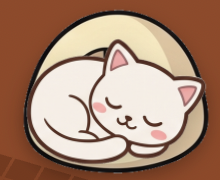

# 🐱 clawd

[](./LICENSE)


> A cute floating cat that lives on your Mac and reacts to your Claude Code usage.

> Cute floating cat that shows your Claude Code usage on macOS.

A tiny, frameless, always-on-top cat that lives on your desktop and changes its
mood based on how hard you're driving Claude Code. Low activity → it naps and
plays. Burning tokens → it gets alert, then hisses. Near your daily budget →
it's exhausted. By default it **roams** — clicks pass straight through and the
cat wanders your screen on its own — until you **grab** it (**⌘⇧C** or the tray)
to drag, click, or configure it.

```
   /\_/\     clawd watches ~/.claude/projects/**/*.jsonl,
  ( o.o )    re-implements ccusage's token+cost aggregation in Rust,
   > ^ <     and maps it onto a 7-state cat.
```

## Screenshots



---

## Features

- **🎨 5 coat colors** — cream · black · orange tabby · gray tabby · white,
  swappable live from the details window.
- **🐈 10+ expressive poses** — sit · walk · run · sleep · alert · angry ·
  exhausted · blink · yawn · stretch · pounce · startled · eating · purr …
- **🚶 Screen wandering** — animated walk/run gaits, direction flip, eased random
  walk clamped to the work area.
- **🛋️ State-driven furniture** — a cushion (sleeping), cat tower (alert/angry),
  and food bowl (exhausted/feeding) appear on cue; the tower **evolves through
  three tiers** with daily usage.
- **🦋 Playthings** — a butterfly, ball, yarn, or bird drifts by and the cat
  chases (and pounces on) it.
- **✨ Micro-events** — ear wiggles, look-backs, and hard blinks keep the resting
  cat alive.
- **🌙 Time-of-day personality** — winds down and sleeps at night, stretches in
  the morning.
- **🖐️ Petting** — hover/hold the cat in Grab mode for a purr.
- **🍚 Feeding** — a button in the details window sends the cat trotting to its
  bowl.
- **🔄 Auto-update** — checks GitHub Releases on launch and one-click installs a
  signed new build (falls back to opening the Releases page when unsigned).
- **📏 Adjustable size** — a 50–200% character-size slider.
- **🖥️ Multi-monitor** — spawns on the display your cursor is on; "이 화면으로
  이동" re-homes it to the current screen.
- **🚀 Auto-start** — optional macOS Login Item.
- **📊 Usage visualization** — model donut, hourly sparkline, weekly heatmap, and
  a "vs. yesterday" delta.
- **🐈‍⬛ Social mode (LAN, experimental)** — opt in and other clawd cats on the
  same network wander onto your screen, each showing a nickname and a *coarse*
  activity vibe (🔥 busy / 💤 idle). Discovery is pure peer-to-peer over mDNS —
  **no server**. Only a nickname, coat color, mood, and activity bucket are
  shared; **never** token counts, cost, or project names. Off by default.
- **🔒 Private by design** — no login and no network calls for stats: it parses
  your local `~/.claude` logs and nothing leaves your machine. The one exception
  is Social mode above, which is strictly opt-in and shares only coarse signals.

---

## Install

Grab the latest **`.dmg`** from the
[**Releases**](https://github.com/NextChans/clawd/releases) page, open it, and
drag **clawd.app** into `/Applications`. The build is a **universal binary**
(Apple Silicon + Intel).

> The `.dmg` is **not code-signed or notarized** (no Apple Developer account),
> so macOS Gatekeeper will complain on first launch — see below.

## First run (Gatekeeper)

Because the app is unsigned, double-clicking it the first time shows
*"clawd" cannot be opened because it is from an unidentified developer* (or
*"is damaged"* on newer macOS). To get past it **once**:

1. In `/Applications`, **right-click** (or Ctrl-click) **clawd.app** → **열기 / Open**.
2. In the dialog, click **그래도 열기 / Open** again.

macOS remembers the choice, so subsequent launches open normally. If the
right-click route is blocked, you can also clear the quarantine flag manually:

```sh
xattr -dr com.apple.quarantine /Applications/clawd.app
```

clawd is a **menu-bar app** (no dock icon) — after launch, look for the 🐾/✋
tray icon. It **checks for updates on launch** and via **tray → 새 버전 확인…**;
when a signed newer build exists you get a one-click update in the details
window, otherwise it falls back to opening the Releases page in your browser.

---

## Concept

- **Floating, no chrome** — transparent background, no title bar, no shadow.
- **Mood = usage** — the cat animates by token rate and daily budget ratio.
- **Two modes — Roam ↔ Grab:**
  - **🐾 Roam** (default) — the window is **click-through** (mouse events pass to
    whatever's behind it) and the cat **wanders the screen on its own**. It never
    gets in your way.
  - **🖐️ Grab** — the cat becomes interactive and holds still: hover for stats,
    drag to move it, click to open details. A glowing ring marks Grab mode.
  - Toggle with **⌘⇧C** or the tray. Roam ↔ Grab flips instantly; a short badge
    confirms the switch.
- **Screen wandering** — in Roam mode the cat window is a full-screen,
  transparent, click-through **overlay**, and the cat strolls around *inside* it
  via GPU-accelerated CSS transforms (60fps, no janky native window moves). It
  **walks / runs** with an animated gait, flips to face its heading, and is
  clamped to the active monitor's work area (never behind the menu bar or dock).
  How lively it wanders tracks its mood: `playing` strolls, `active` dashes
  (running), `angry` fidgets in place, `exhausted` barely shuffles, `sleeping`
  stays put.
- **Menu-bar app** — no dock icon; control it from the tray.

## Cat states

| State       | When                                              | Look                          |
|-------------|---------------------------------------------------|-------------------------------|
| `sleeping`  | idle > 30 min, no active session                  | eyes closed, `z z z`, slow    |
| `playing`   | very low / no rate                                | happy eyes, sparkle, fast tail|
| `curious`   | rate > `low`                                      | wide eyes, `?`                |
| `active`    | rate > `mid`                                      | open eyes, gentle smile       |
| `alert`     | rate > `high` **or** budget > 60%                 | big eyes, raised ears, `!`    |
| `angry`     | rate > `veryHigh` **or** budget > 85%             | flat ears, fangs, hiss        |
| `exhausted` | budget > 95% **and** rate > `high`                | `><` eyes, sweat drop         |

Only `playing`, `alert`, and `angry` are strongly differentiated in this first
draft; the other four reuse the same rig with tweaked expression/pose/color.

## Requirements

- **macOS** (built and tuned for macOS).
- **Node ≥ 20** — `node --version`
- **Rust (stable)** — `rustc --version`. If missing:
  ```sh
  curl --proto '=https' --tlsv1.2 -sSf https://sh.rustup.rs | sh -s -- -y
  source "$HOME/.cargo/env"
  ```
- **Xcode Command Line Tools** — `xcode-select --install`

## Run

```sh
npm install
npm run tauri dev
```

## Build

```sh
npm run tauri build
```

The bundled `.app` and `.dmg` land in `src-tauri/target/release/bundle/`
(**unsigned** — see [First run](#first-run-gatekeeper)).

To produce the **universal** (Apple Silicon + Intel) DMG that Releases ship —
the same artifact CI builds — and open the output folder:

```sh
npm run release:local
# → src-tauri/target/universal-apple-darwin/release/bundle/dmg/
```

> Universal builds compile the Rust core **twice** (both arches), so expect
> 5–15 min, especially the first time.

## Release process

Releases are built by GitHub Actions (`.github/workflows/release.yml`): pushing
a **`v*` tag** triggers a `macos-latest` runner that builds the universal DMG
and publishes a Release with auto-generated notes and the DMG attached.

```sh
npm run version:bump 0.6.0    # syncs package.json + Cargo.toml + tauri.conf.json
git commit -am "chore: bump to 0.6.0"
git tag v0.6.0
git push && git push --tags   # tag push kicks off the Release workflow
```

Watch the run under the repo's **Actions** tab; the DMG appears on the Release
once it's green.

> **Cost note:** macOS Actions minutes are limited on the free tier
> (~300 min/month for personal accounts, and macOS runners bill at 10×), and
> universal builds are slow — so tag deliberately, not on every commit.

**Fallback** if CI fails — build and publish locally with the `gh` CLI:

```sh
npm run release:local   # or: npm run tauri:build:universal
gh release create v0.6.0 --generate-notes \
  src-tauri/target/universal-apple-darwin/release/bundle/dmg/*.dmg
```

## Permissions (macOS)

- **Notifications** — for the 80% / 100% daily-budget alerts. Allow when
  prompted (toggle alerts off in the details window if you don't want them).

That's it — the **⌘⇧C** hotkey uses Tauri's global-shortcut plugin and needs
**no Accessibility permission**. (Earlier builds used an `rdev` keyboard monitor
for an Option-key hold; that was removed — see the changelog.)

## Usage

- **🐾 Roam mode (default)** → the cat is **click-through** (mouse events pass to
  the window behind it) and **wanders the screen on its own**. It never gets in
  your way.
- **⌘⇧C** (or tray → *🖐️ 잡기 (Grab)*) → switch to **Grab mode**. Wandering stops,
  a glowing ring appears, and the cat becomes interactive:
  - **hover** → tooltip with today's tokens / cost / rate
  - **drag** → move the cat (position is remembered across launches)
  - **click** → open the details window
- **⌘⇧C** again (or tray → *🐾 놀기 (Roam)*) → back to Roam; the cat resumes
  wandering from wherever you left it.
- **Tray menu** → pick Roam / Grab, show/hide the cat, reset position, **move to
  the current screen (이 화면으로 이동)**, open details/settings, check for
  updates, quit. The tray tooltip and a small menu-bar suffix (`✋`) show which
  mode you're in.

## Tuning thresholds

Open the details window (⌘⇧C then click the cat, or tray → *상세 · 설정*):

- **Cat color** — pick one of the five coats.
- **Character size (캐릭터 크기)** — 50–200% render scale for the cat sprite.
- **Auto-start (로그인 시 자동 시작)** — register/unregister the macOS Login Item.
- **State thresholds (tokens/min)** — `curious / active / alert / angry` cutoffs.
  `exhausted` is entered automatically when the rate stays above the `alert`
  threshold for a sustained ~30 min window.

Settings persist via the Tauri store (`config.json` in the app config dir) and
sync live between the cat and details windows.

> **Note on token counts:** totals include `cache_read` tokens, which are cheap
> but voluminous, so tokens/min runs large during active sessions. The default
> thresholds account for this; tune to taste.

## Cat art & coat colors

The cat renders from **PNG sprites** in `src/assets/cat/<color>/<pose>.png`,
falling back to a built-in **vector cat** (`CatSvg.tsx`) for any sprite that
isn't present — so the app runs fine with the sprite folders empty and you can
fill them in incrementally.

- **Colors** (pick in the details window; persists in config, live-syncs to the
  cat): `cream` · `black` · `orange_tabby` · `gray_tabby` · `white`.
- **Poses** (9): `sit_forward`, `walk_right_a/b`, `run_right_a/b`,
  `sleep_curled`, `alert_arched`, `angry_hiss`, `exhausted_lie`. Walk/run are
  two-frame flip animations; side poses face right and mirror automatically.

See **[`src/assets/cat/README.md`](src/assets/cat/README.md)** for the exact
file layout, image requirements (transparent, square, centered), and a ready-to-
use **Nano Banana / Gemini image prompt** for generating a consistent set.

## How usage is computed

`src-tauri/src/usage.rs` walks `~/.claude/projects/**/*.jsonl`, and for each
assistant turn with a `usage` block it:

1. dedupes by `message.id` + `requestId` (the same message can appear in
   multiple files),
2. prices it from a hardcoded per-model table (Opus / Sonnet / Haiku families;
   see `price_for`),
3. buckets it into today / last-5-min / week / month, plus a "session active in
   the last 30s" flag.

The frontend polls this every 30 s (Rust emits a `usage` event).

### Pricing (USD per 1M tokens, approximate)

| Family | Input | Output | Cache write | Cache read |
|--------|------:|-------:|------------:|-----------:|
| Opus   | 15.00 | 75.00  | 18.75       | 1.50       |
| Sonnet |  3.00 | 15.00  |  3.75       | 0.30       |
| Haiku  |  0.80 |  4.00  |  1.00       | 0.08       |

Unknown models fall back to Sonnet pricing. Update `price_for` in `usage.rs`
when prices change.

## Project layout

```
clawd/
├─ index.html
├─ src/                      # React + TS frontend
│  ├─ main.tsx               # routes cat vs. details window (?window=details)
│  ├─ App.tsx                # cat window (drag / click / tooltip)
│  ├─ Details.tsx            # details + settings window
│  ├─ types.ts               # Usage / Config / CatState + defaults
│  ├─ hooks/
│  │  ├─ useUsage.ts         # get_usage + `usage` event subscription
│  │  ├─ useConfig.ts        # Tauri store config, synced across windows
│  │  ├─ useUpdater.ts       # self-update (check / download / install)
│  │  └─ useCatState.ts      # usage → CatState classifier
│  ├─ components/Cat/        # SVG cat + CSS animations
│  └─ utils/format.ts
├─ scripts/
│  ├─ bump-version.mjs       # sync version across the three manifests
│  ├─ setup-updater-key.sh   # one-time updater signing-key setup (run manually)
│  └─ gen-updater-manifest.mjs  # build latest.json from the signed artifacts
└─ src-tauri/                # Rust backend
   ├─ src/
   │  ├─ lib.rs              # window setup, Roam/Grab mode, hotkey, poller, monitors
   │  ├─ roam.rs             # wander scheduler (emits cat-wander events)
   │  ├─ usage.rs            # ccusage-style aggregation
   │  └─ tray.rs             # menu-bar tray (mode radio + status)
   ├─ tauri.conf.json        # cat + details window config + updater endpoint
   └─ capabilities/default.json
```

## Known limitations

- **Cat art + gaits are a hand-drawn draft.** Playing / alert / angry read
  clearly; the other four states are lightweight variations. The walk / run /
  jitter gaits are an initial pass (body bob + alternating paws + tail) — good
  enough to read as motion, but ripe for refinement.
- **One monitor at a time.** The overlay spawns on the display your cursor is on
  and can be re-homed with **tray → 이 화면으로 이동**, but it lives on a single
  monitor — the cat won't wander across displays simultaneously, and automatic
  re-homing on display reconfiguration is best-effort (fires on DPI/scale
  changes).
- The log scan re-reads all files every 30 s — fine for typical histories, but
  not incremental. Large histories could be cached by mtime later.
- macOS only. Windows/Linux would need a different global-shortcut strategy.
- Prices are hardcoded approximations; verify against current Anthropic pricing.

## Changelog

- **Unreleased** — **Auto-update, character size, multi-monitor.** The tray
  "새 버전 확인" and a launch-time check now use Tauri's **updater**: signed
  `.app.tar.gz` artifacts + a `latest.json` on each Release let the app download
  and install a new build in place (one click in the details window), with a
  graceful fallback to opening the Releases page when a build is unsigned. Added
  a **character-size slider** (50–200%) and **cursor-aware multi-monitor
  placement** — the overlay spawns on the display under the cursor and a new tray
  item **이 화면으로 이동** re-homes it. Signing is set up once via
  `scripts/setup-updater-key.sh`; `scripts/gen-updater-manifest.mjs` and the
  release workflow produce `latest.json`. **Note:** the updater only kicks in for
  releases *after* the signing key + pubkey are configured.
- **v0.5.0** — **Automated DMG releases + in-app update check.** Pushing a
  `v*` tag now builds a **universal (Apple Silicon + Intel) DMG** on GitHub
  Actions and publishes a Release with the DMG attached
  (`.github/workflows/release.yml`). Added `scripts/bump-version.mjs`
  (`npm run version:bump <ver>`) to keep the version in lockstep across
  `package.json`, `src-tauri/Cargo.toml`, and `tauri.conf.json`, plus
  `npm run release:local` for a one-shot local universal build. New tray item
  **새 버전 확인…** opens the Releases page in the browser (the repo is private,
  so this rides the user's existing GitHub session rather than an unauthenticated
  API call). Builds are still **unsigned** — the README documents the Gatekeeper
  first-run step.
- **v0.4.0** — **PNG sprite cat + coat colors + tooltip auto-flip + tray title
  sync.** The cat now renders from **PNG sprites**
  (`src/assets/cat/<color>/<pose>.png`) so the character can be authored as real
  art (e.g. Nano Banana / Gemini image) instead of hand-drawn SVG — with a
  built-in **vector fallback** (`CatSvg.tsx`) for any sprite not present yet, so
  the app runs before the art arrives and degrades gracefully. Walk/run are
  two-frame flip animations; side poses face right and mirror with `scaleX(-1)`.
  Added **5 coat colors** — cream, black, orange & gray tabbies, white —
  selectable from a new swatch picker in the details window (persists in config,
  live-syncs to the cat window); each color is a folder of sprites (and a themed
  palette for the vector fallback). Along the way the vector cat was also redrawn
  chunky/sticker-style with per-pose viewpoints. The **tooltip now auto-flips**:
  it measures the cat against the (small, edge-clamped) grab window and hugs the
  near edge — or drops below the cat — so it never clips off-window (it also
  fades only now, so framer-motion no longer clobbers the centering transform).
  The **tray title** reliably reflects the mode (🐾 Roam / ✋ Grab) — macOS
  wouldn't clear a `None` title, so the "✋" suffix used to stick after switching
  back to Roam.
- **v0.3.0** — **Full-screen overlay + smooth walking/running animation.**
  Reworked wandering from the ground up. The cat window is now a screen-sized,
  transparent, **click-through overlay** and the cat moves *within* it via
  GPU-accelerated CSS `translate3d` transitions — no more nudging the native
  window every frame (which never animated smoothly on macOS). Rust
  (`roam.rs`) is now just a scheduler: every few seconds it emits a `cat-wander`
  event (target, duration, direction, gait) and the browser tweens there at
  60fps. Added **walk / run / jitter** SVG gaits (body bob, alternating paws,
  livelier tail) plus **direction flip** so the cat faces where it's going,
  scaled to mood. Grab mode shrinks the overlay back down around the frozen cat
  (interactive again), then re-expands to full-screen on return — click-through
  is asserted before every resize so **other windows are never blocked** (0
  interference preserved). Tooltip / badge / first-run hint now ride with the
  cat. Primary monitor only for now (see limitations).
- **v0.2.0** — **Roam ↔ Grab modes + screen wandering.** Replaced the old
  "pin" concept with two clear states: **Roam** (default — click-through and the
  cat auto-wanders the screen) and **Grab** (interactive and frozen for
  drag/click/settings). Wandering is a smooth eased random walk clamped to the
  active monitor's work area, with liveliness driven by the cat's mood (`roam.rs`).
  Toggle via **⌘⇧C** or the redesigned tray (Roam/Grab radio + status suffix).
  Also: widened the cat window (240×210) and re-anchored the tooltip inside it so
  stats no longer clip, added mode-switch badges, and a first-run hint.
- **v0.1.1** — Removed the `rdev` global keyboard monitor. It called macOS
  Text Services (`TSMGetInputSourceProperty`) off the main thread, which
  tripped `dispatch_assert_queue` and crashed the app (`SIGTRAP`) whenever a
  screenshot tool (⌘⇧3/4/5) launched or the Option key was pressed. Grab mode
  is now driven solely by the **⌘⇧C** global shortcut (Tauri's
  `global-shortcut` plugin, no Accessibility permission needed), with a glowing
  ring for visual feedback.
- **v0.1.0** — Initial scaffold: floating cat + ccusage integration.

## Roadmap

**Done**

- [x] Roam ↔ Grab modes + full-screen click-through overlay
- [x] Smooth walk/run wandering with direction flip
- [x] 5 coat colors + PNG sprites (vector fallback)
- [x] State-driven furniture (cushion / tower / bowl) + tower tier evolution
- [x] Playthings, micro-events, time-of-day personality
- [x] Petting + feeding
- [x] Usage viz — model donut, hourly sparkline, weekly heatmap, yesterday delta
- [x] Automated universal DMG releases via GitHub Actions
- [x] In-app **auto-update** with signed artifacts
- [x] Adjustable character size
- [x] Cursor-aware **multi-monitor** placement + "이 화면으로 이동"
- [x] Optional auto-start (Login Item)

**Next up**

- [ ] Wander across **multiple monitors** simultaneously (not just re-home)
- [ ] Team dashboard — several cats splitting shared usage
- [ ] A companion **CLI** (`clawd status`) for headless usage
- [ ] Richer / Lottie animations and more distinct per-state poses
- [ ] Optional sounds (meow, hiss), off by default
- [ ] Detect Claude usage beyond Claude Code (direct Anthropic API traffic)
- [ ] Incremental log tailing instead of full rescans
- [ ] Windows / Linux support

## Contributing

Fork-and-PR welcome — bug fixes, new poses/colors, and animation polish
especially.

1. **Fork** and branch off `main`.
2. Make your change and keep the two gates green:
   ```sh
   cargo fmt --manifest-path src-tauri/Cargo.toml   # Rust formatting
   npm run build                                    # tsc typecheck + vite build
   ```
   (a `cargo check` in `src-tauri/` doesn't hurt either).
3. Match the surrounding style — the code leans on doc comments that explain the
   *why*; please keep that up for non-obvious logic.
4. Open a PR with a short description and, for anything visual, a screenshot or
   clip. New art goes under `src/assets/cat/<color>/` — see that folder's README.

**Issues:** include your macOS version, how you installed (DMG vs. local build),
and steps to reproduce. Feature ideas are welcome too — check the roadmap first.

## License

MIT License. See [LICENSE](./LICENSE). 🐾
